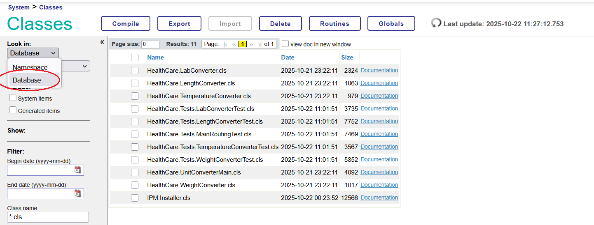

# HealthCare Unit Converter

A modular unit conversion system designed for healthcare applications. It supports conversions for length, weight, temperature, and laboratory test values (e.g., glucose, creatinine, cholesterol).

## Project Overview

This project uses a controller-service architecture:

- `HealthCare.UnitConverterMain` acts as the main controller
- It routes conversion requests to specialized converter classes based on category
- Each converter class handles its own conversion logic and supported units

## Core Classes

| Class | Purpose |
|-------|---------|
| `HealthCare.UnitConverterMain` | Main entry point, input validation, routing |
| `HealthCare.LengthConverter` | Handles length unit conversions |
| `HealthCare.WeightConverter` | Handles weight unit conversions |
| `HealthCare.TemperatureConverter` | Handles temperature conversions |
| `HealthCare.LabConverter` | Handles laboratory test value conversions |

## Key Features

- **Input Validation**: Comprehensive validation for values, units, and categories
- **Error Handling**: Descriptive error messages for invalid inputs
- **Precision Control**: Configurable decimal precision (0-10 digits)
- **Case Insensitive**: Unit and category names are case-insensitive
- **Modular Design**: Easy to extend with new conversion categories

## Supported Categories

- **Length**: m, cm, mm, in, ft, yd
- **Weight**: kg, g, mg, lb, oz  
- **Temperature**: c, f, k
- **Lab Tests**:
  - Glucose: mg/dL ↔ mmol/L
  - Creatinine: mg/dL ↔ μmol/L
  - Cholesterol: mg/dL ↔ mmol/L

## Installation

1) **Management Portal / Class Editor**
  - Open the Class Editor or navigate to the import tools in the Management Portal and compile the classes from `src/HealthCare`.
  - Make sure you are looking into the Database instead of Namespace
  

  - Optionally, you can also load your classes into IRIS using the Terminal:
    - Navigate to IRIS terminal
    - Switch to your namespace (for example USER):
    ```
    zn "USER"
    ```
    - Compile all classes:
    ```
    do $system.OBJ.CompileAll()
    ```

2) **ZPM**
  - Make sure you have ZPM installed
  - In IRIS terminal switch to Package Manager Shell (ZPM) by typing `zpm`
    ```
    USER>zpm
    zpm:USER>
    ```
  - Load the correct directory 
    ```
    zpm:USER>load C:\to\your\path\SoftWareIntegration_UnitConverter
    ```
  - Compile the module
    ```
    zpm:USER>SoftWareIntegration-UnitConverter compile
    ```
  - Test the module 
    ```
    zpm:USER>SoftWareIntegration-UnitConverter test
    ```
  - You can view the module info, it should appear as 
    ```
    zpm:USER>list
    softwareintegration-unitconverter 1.0.0
    ```
  - Verify installation
    ```
    zpm:USER>SoftWareIntegration-UnitConverter verify
    ```

## Usage Example

```objectscript
// Basic usage 1, category "lab", default 2 decimal places
set result = ##class(HealthCare.UnitConverterMain).Convert(180, "mg/dL", "mmol/L", "lab", "glucose")
write result  // Output: "9.99"

// Basic usage, default 2 decimal places
set result = ##class(HealthCare.UnitConverterMain).Convert(39.370079, "in", "m", "length")
write result // Output: "1.00"

// Basic usage,  4 dicimals
set result = ##class(HealthCare.UnitConverterMain).Convert(100.12345, "cm", "m", "length", "", 4)
write result // Output: "1.0012"

// Get conversion information
set info = ##class(HealthCare.UnitConverterMain).GetConversionInfo()
write info
```